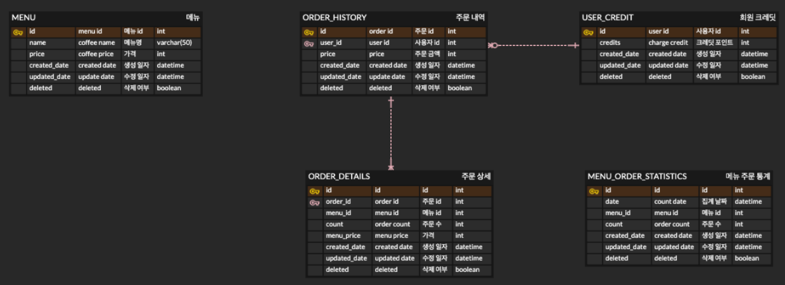
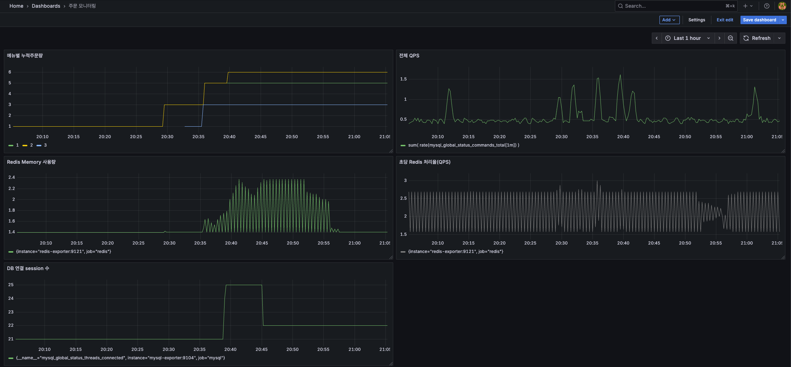

# order-system

### 주문 시스템

이 프로젝트는 아이스크림 주문시스템 구현을 간단하게 설계 및 구현한 공개용 프로젝트입니다.
코드스타일 및 아키텍처 설계등을 파악하실 수 있습니다.

---

## API 목록

아이스크림 주문 시스템 구현

1) 메뉴 조회 API
2) credit 충전하기 API
3) 주문하기 API
4) 인기메뉴 조회 API
5) Gpt에게 메뉴 추천받기

## SPEC

Kotlin MySQL JPA Redis

## DB ERD



-----

# 아이스크림 주문 시스템 (Icecream Order System)

## 프로젝트 개요

### 서비스 설명

- **아이스크림 주문 시스템**은 사용자들이 아이스크림 메뉴를 확인하고, 크레딧을 충전하여 주문할 수 있도록 설계된 간단한 API 서비스입니다.
- 크레딧을 사용해 결제하며, 최근 인기 메뉴를 확인할 수도 있습니다.
- Gpt를 통해 대화형으로 메뉴 추천 기능도 제공합니다.

---

## 아키텍처

### 설계 개요

- **Spring Boot** 기반으로 개발
- **Redis**: 인기 메뉴 캐싱 및 동시성 제어
- **MySql**: 데이터 영속화
- **Kafka**: 비동기 주문 처리
- **JPA**: ORM 프레임워크
- **Docker**: 컨테이너화
- **Gatling**: 성능 테스트
- **Prometheus, Grafana**: 모니터링

### 계층 구조

- **Controller Layer**: RESTful API 엔드포인트 제공
- **Service Layer**: 비즈니스 로직
- **Domain Layer**: 도메인 로직 집중
- **Repository Layer**: 데이터베이스 연동

---

## 주요 기능

### 📘 API 목록

| API      | Method | Endpoint               | 설명          |
|----------|--------|------------------------|-------------|
| 메뉴 조회    | GET    | `/api/order/menu`      | 전체 메뉴 조회    |
| 인기 메뉴 조회 | GET    | `/api/order/menu/best` | 최근 인기 메뉴 조회 |
| 크레딧 충전   | POST   | `/api/order/charge`    | 사용자의 크레딧 충전 |
| 주문 및 결제  | POST   | `/api/order`           | 메뉴 주문 및 결제  |

---

## 설정 및 실행

### 로컬 환경 구성

1. **Clone Repository**
   ```bash
   git clone https://github.com/MinjeongJane/order-system.git
   cd order-system
   ```

2. **Docker Compose 실행**
   ```bash
   ./gradlew build
   docker-compose up -d
   ```  
    ```bash
   docker exec -i my-redis redis-cli < ./src/main/resources/redis-init.txt
   ```

3. **빌드 및 실행**
   ```bash
   ./gradlew bootRun
   ```

---

## 테스트 전략

### 테스트 종류

| 테스트 유형 | 도구               | 설명            |
|--------|------------------|---------------|
| 유닛 테스트 | JUnit, MockK     | 개별 메서드 테스트    |
| 통합 테스트 | Spring Boot Test | 서비스 계층 전체 테스트 |

### 테스트 실행

   ```bash
   ./gradlew test
   ```

---

## 개발자 참고 사항

1. **코드 스타일**: Kotlin의 코딩 컨벤션을 준수합니다.
2. **에러 응답**: 통일된 에러 응답 포맷을 사용합니다.
   ```json
   {
       "status": 400,
       "error": "Bad Request",
       "message": "Invalid user ID"
   }
   ```
3. **확장성 고려**: DDD Layered Architecture 적용하여, 서비스별로 확장이 용이한 모듈 구조를 따릅니다.

---

## 향후 개선 사항

- 사용자 인증(JWT) 및 권한 관리
- 크레딧 충전 내역 테이블 추가
- 주문/결제 기능을 분리

-------------------------------------

## 모니터링

Grafana 대시보드 설정

```
            Micrometer                 scrape
[OrderService] ──→ /actuator/prometheus ←── Prometheus ──→ Grafana
```



---

## 성능 테스트

| API                              | 특징                         | 중점 확인 지표                 | 의심 병목                          |
|----------------------------------|----------------------------|--------------------------|--------------------------------|
| `/api/order/menu` (메뉴 조회)        | 단순 JPA 조회 + 로컬 캐시 사용       | TPS, 응답속도                | 캐시 미적중, DB N+1                 |
| `/api/order/charge` (크레딧 충전)     | 단건 update                  | 응답속도, 트랜잭션 성능            | 동시성, Lock, update 빈도           |
| `/api/order` (주문)                | Redis, JPA, Kafka, 트랜잭션    | 처리 시간, Kafka 전송 성공률, 오류율 | Redis TPS, Kafka 전송 실패율, DB 병목 |
| `/api/order/best-menu` (인기메뉴 조회) | Redis 캐시 or DB Aggregation | 캐시 적중률, 쿼리 속도            | Redis TTL, DB GROUP BY 성능      |

```bash
./gradlew gatlingRun

```

result : 

* global :
  [Order_Gatling.pdf](src/main/resources/image/Order_Gatling.pdf)
* 크레딧 충전 :
  [Gatling_ChargeCredits.pdf](src/main/resources/image/Gatling_ChargeCredits.pdf)
* 메뉴 조회 :
  [Gatling_Menu.pdf](src/main/resources/image/Gatling_Menu.pdf)
* 주문 :
  [Gatling_Order.pdf](src/main/resources/image/Gatling_Order.pdf)
* 베스트 메뉴 조회 :
  [Gatling_BestMenu.pdf](src/main/resources/image/Gatling_BestMenu.pdf)
